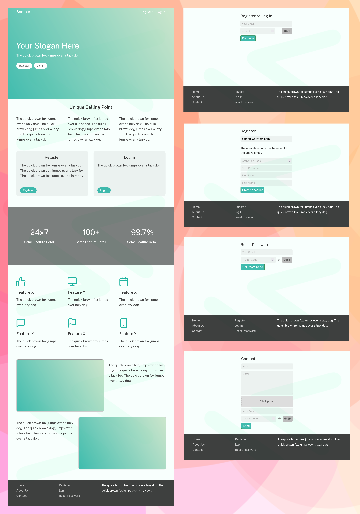

# Minimal Framework

A minimal style of Java framework for web application and web service

```
1. Clone the project
   git clone https://github.com/kookiatsuetrong/start-web
   cd start-web

2. Execute database schema (schema.sql)
   sudo mysql < schema.sql

3. Build the system
   bash build.sh

Open web browser to http://localhost:7300
```



### Configuration file

The configuration is the file "setup.txt".

```
emailEnabled  = true
emailPassword = Hello12345
emailAddress  = support@sample.com
emailServer   = smtp.sample.com
emailSender   = Sender Name
emailPort     = 587
emailSecurity = TLSv1.2
```

The transaction email can be disabled by
writing "emailEnabled = false".


### Sample Code
```java
import start.web.Server;

class Sample {
	
	void start() {
		var server = Server.getInstance();
		server.handle("/another", () -> "Another Web Page");
	}
	
}
```

### Forward versus Redirect

```
Context.forward() reserves HTTP verb.
Context.redirect() sends HTTP 301 code.
```


### Product Backlogs
```
M01: As a member, 
	I want to have my profile picture.

V01: As a visitor, 
	I want to copy/paste my photo in the contact page.

V02: As a visitor, 
	I want to create account from my social network account 
	including Facebook or Google.

A01: As an administrator,
	I want to configure connection string.

```
